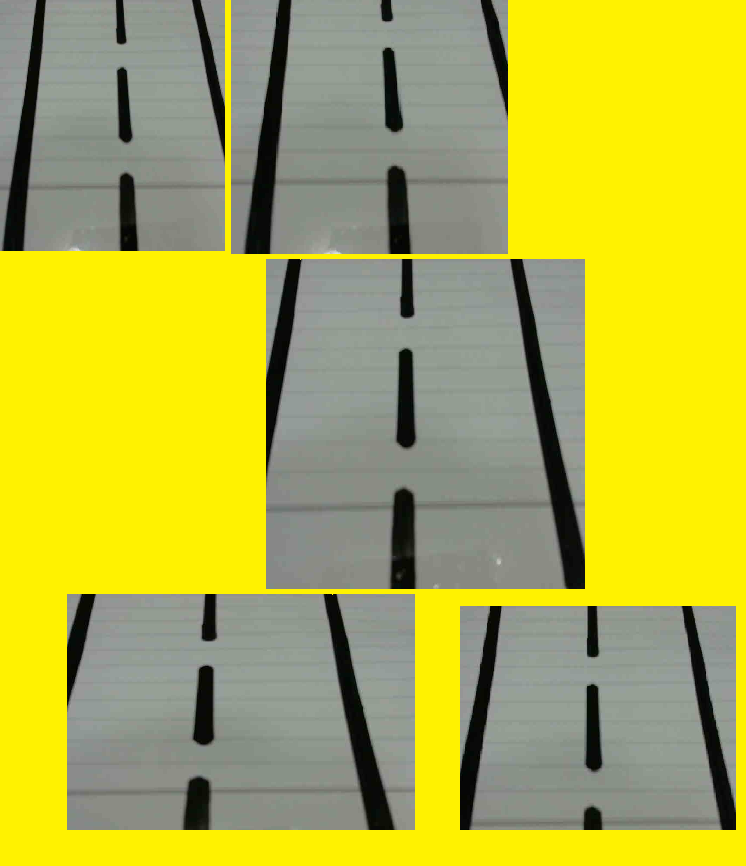

# Road-Track-follower-Rover
The Rover which will track the road, follow the turns with Simple USB camera.

Here the rover Camera take the picture and Apply the templete match algorithm with minimum error in the RaspberryPi System to get the desired output. if there is any drift from the templete image then i give more pulse to opposite motor the put rover on track

The Templates for tracking

Tracking Rover
.jpg)
